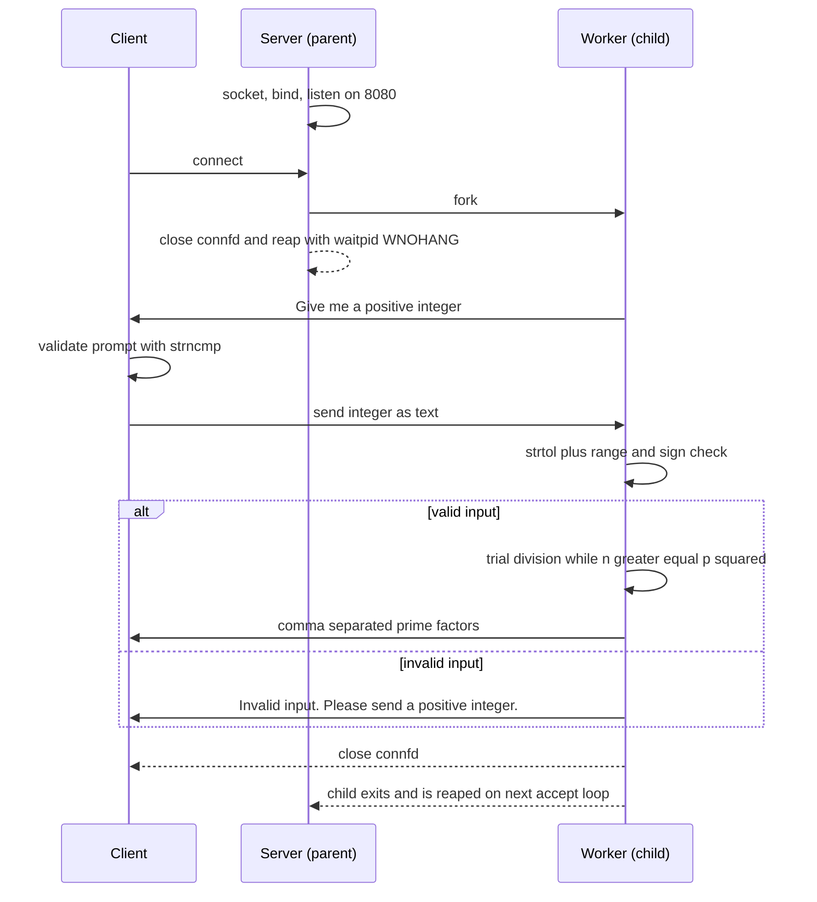

# TCP Prime Factors Server & Client

A C based TCP client - server application that exchanges integers and computes 
their prime factors. Originally developed as coursework for a distributed systems course at the University of 
Western Macedonia, now published as a personal repository.

## Overview

This project demonstrates low-level network programming in C using the 
Berkeley sockets API. It includes both a server and a client:

* **Server**
   * Listens on TCP port `8080` with `SO_REUSEADDR` enabled for quick restarts
   * Spawns a child process (`fork()`) for each incoming connection, allowing concurrent clients without threading
   * Reaps terminated children non-blockingly with `waitpid(WNOHANG)` at the top of the accept loop to prevent zombie processes
   * Prompts the client for a positive integer over the socket
   * Validates input with `strtol` (checking range, format, and sign) and returns its prime factors as a comma-separated list
   * Closes the connection gracefully after responding
* **Client**
   * Connects to the server using an IP passed as a command-line argument
   * Verifies the server's initial prompt matches the expected protocol before sending input
   * Reads a positive integer from standard input and transmits it as a newline-terminated string
   * Displays the server's messages and the calculated prime factors
   * Reports socket errors descriptively via `perror` at every syscall

## Protocol Flow



## Key Concepts Demonstrated

* TCP socket creation, binding, listening, accepting, and bidirectional communication
* Process forking for handling multiple clients, with correct file descriptor hygiene in parent and child
* String parsing and numeric validation using `strtol` with full error checking
* Prime factorization in C using trial division up to √n
* Graceful handling of socket errors with cleanup at every failure point

## Compile

```bash
gcc -o server server.c
gcc -o client client.c
```

## Run server

```bash
./server
```

## Run client (in another terminal)

```bash
./client 127.0.0.1
```

## Docker

The server ships with a multi stage Dockerfile that compiles in a `debian:stable-slim` build image and copies only the stripped binary into a clean runtime image thus keeping the final image small and free of `gcc` and build dependencies.

```bash
docker build -t prime-factors-server .
docker run --rm -p 8080:8080 prime-factors-server
```

Then connect from the host as usual:

```bash
./client 127.0.0.1
```

The container exposes port `8080`; the `-p 8080:8080` flag maps it to the same port on the host.

## Author

Dimitrios Dalaklidis, Graduate of the School of Sciences(STEM) with a 4-year degree in Informatics from the public EU/Greek University of Western Macedonia (THE World University Rankings: Computer Science 601-800 for 2025). Backend and systems: open - source contributor to Amazon Ion's `fusion-java` runtime (3 merged PRs) with other projects spanning Spring Boot REST APIs, FastAPI services with Redis and CI/CD to AWS and systems programming in C. Based in Thessaloniki

Reach me at [dalaklidesdemetres@gmail.com](mailto:dalaklidesdemetres@gmail.com) · [GitHub](https://github.com/DimitriosDalaklidhs) · [LinkedIn](https://www.linkedin.com/in/dimitris-dalaklidis-a72838397/)
